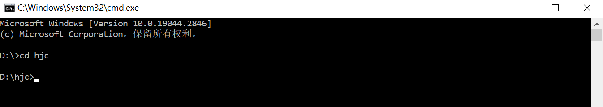
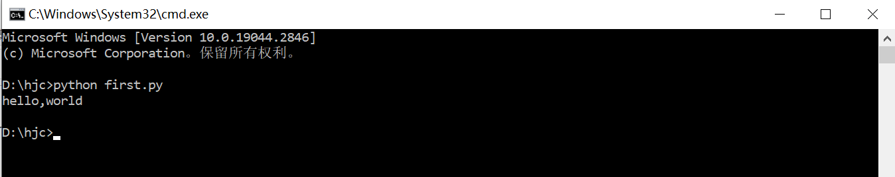
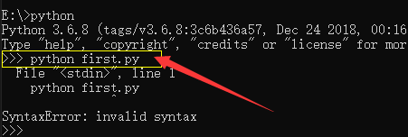

=================
第一个Python程序
=================

我们现在就来看看如何编写运行Python代码:

大家可以新建一个文件，起名为 first.py。

Python代码文件的扩展名就是 **.py** 。 文件名最好是英文。

然后，可以用 notepad++ 打开这个文件，输入如下的代码:

``print("hello world")``

这行代码的意思就是：把引号里面的 字符串 hello world 打印到 屏幕上。

这就是一个非常简单的程序代码了。

接下来我们要 **运行这个代码文件** ， 怎么运行？

对了，前面就说过： **用Python解释器运行**

我们通常是在命令行窗口执行代码文件的。

请大家打开一个Windows命令行窗口。

执行Python代码 的命令格式是这样的：
``python <代码文件名>``

其中：

**python ：表示运行解释器程序Python**
**<代码文件名> ： 是参数，指定要执行哪个代码文件**

我们现在要运行 first.py。

1. 首先要进入代码文件所在的目录。 怎么进入？ 用 cd 命令。 不会的同学请百度搜索 “DOS 命令 CD”。比如，我这里，first.py 文件在 ``d:\hjc`` 目录下面 ，就要进入该目录
   

2. 在命令行里面敲入命令,然后按 **回车键**
   
.. code-block:: console

    D:\>cd hjc
    D:\hjc>python first.py

很多初学者会犯这个错误，他们居然在 Python 交互式命令行中 敲入 执行python程序的命令，像下面这样

.. warning:: 
    执行python脚本的命令要在 Windows命令行 而不是 Python 交互式命令行 里面执行 !!

上面的情况，你需要先执行 ``exit()`` 语句退出 Python 交互式命令行，然后敲入运行python程序的命令 像这样

.. code-block:: console

    >>> exit()
    D:\hjc>

理解代码
================

好，我们再来看一下这个简单的代码文件，理解一些概念。

编程语言，可以和人类语言类比。

人类语言是说给谁听的？对了，说给人听的。

编程语言呢？ 是给计算机听的。

编程语言就是告诉计算机该怎么去干事情。

我们要让别人做事情，用人类语言。比如告诉别人怎么去开车，会说

.. code-block:: 

    踩离合器，
    档位杆 推到1挡位置
    慢慢抬起脚，松离合器

这些话，我们称之为 **语句** 。

每条语句可以表达一个完整的意思。

同样的，我们的Python 程序语言，告诉计算机该怎么做的时候，也是使用语句。

比如，我们这里的语句

.. code-block:: python

    print('hello,world')

就是用 Python语言 对计算机说：请你把这个字符串 hello world 显示到屏幕上。

语句就是： 完成一个完整的语义的最小单元，表达一个完整的意思。就好像人类语言中的一句话。

人类语言的语句，可能很短，也可能很长。

Python代码中的语句也是一样，可能很短，像这样

.. code-block:: python

    pass

也可能很长，比如

.. code-block:: python

    nameTable = {
        '小王1' :  35,
        '小王2' :  25,
        '小王3' :  32,
        '小王4' :  15,
        '小王5' :  36,
        '小王6' :  25,
        '小王7' :  45,
        '小王8' :  15,
        '小王9' :  25,
        '小王10' :  36,
        '小王11' :  33,
        '小王12' :  15,
        '小王13' :  35,
        '小王14' :  45,
        '小王15' :  23,
    }

为了阅读方便， 很长的语句，可以放在多行中，像上面这样

程序的代码就是由若干条 语句 组成的。

再看，其中 ``print`` 是个内置函数的名字。

函数名 就代表了 预先实现的 一个功能。函数的概念，后面的章节会具体讲解。

这里的 函数 ``print`` 实现的功能就是： 输出字符串到终端屏幕上。

Python 程序中 出现 ``print``，解释器就知道： 要输出 后面的字符串 到终端上。

我们直接拿来用就可以了。

一些规则
=========

现在我们先看看一些简单的编写代码的规则

1. Python 是 大小写敏感 的语言。
   比如 print 函数名，该函数定义就是全部小写的， 不能写成 Print 或者 PRINT。

2. Python 代码第一行语句必须顶到最左边，不能有空格。

.. code-block:: python

        print('hello,world')

一定要顶到最左边，像这样

.. code-block:: python

    print('hello,world')

3. 多行语句的行首要对齐

.. code-block:: python

    print('hello,world')
    print('今天天气怎么样？')

不能这样，就不对齐了

.. code-block:: python

    print('hello,world')
        print('今天天气怎么样？')
