==================
安装Python解释器
==================

什么是编程
============

**编程** 的目的就是让计算机按你 **设定好的流** 去做事 。

这个 **设定好的流程** 就是 **程序** ，或者叫 **代码**。 程序代码保存在文件中 。

计算机按设定的流程去执行做事，就是 **运行程序**

设定流程的人，就是 **程序员** ，俗称 **码农**。

我们通过别人开发的程序（比如 QQ、支付宝、微信），控制计算机（智能手机也可以看做计算机），是间接的控制。

而我们自己开发程序，就可以更直接的控制计算机按照我们的想法来办事。

程序员怎么写程序呢？

我们写给 **人** 看的 文章 ， 使用 **人类语言** 。

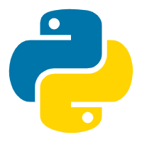

而写给 **计算机** 执行的 **程序文件** ，必须使用 **编程语言** ， 因为目前的计算机不能直接读懂人类语言。

所以，要成为一个程序员， 随心所欲的让计算机 按你的指示办事， 必须掌握好编程语言。

而我们选择的就是PYTHON语言

Python解释器
================

我们编写程序代码，就是要 **让计算机 按照我们的想法 去做事** 。

程序代码是用编程语言编写的，而Python语言， 是计算机硬件（主要是CPU）听不懂的语言。

计算机CPU只能听懂 机器指令。

所以，我们需要一个翻译， 把Python语言翻译成 计算机CPU能听懂的机器指令。

这个翻译就是 **Python解释器**。

.. note::
    
    我们运行Python程序，就是 运行Python解释器，让解释器去读取我们写好的Python代码文件，并且把Python代码翻译成 机器指令 给 CPU 去执行。

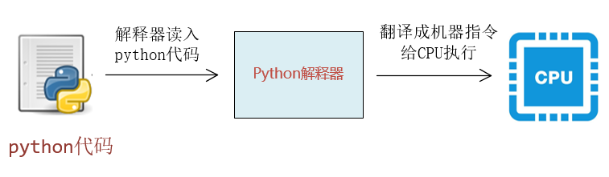

Python解释器 **本身也是个程序**， 它是解释执行 **Python代码的**，所以叫解释器。

没有Python解释器，我们的Python代码是没有办法运行的。

所以 学习Python的第一步 就是： 安装Python解释器 。

下载Python解释器
===================

`Python官方网站 <https://www.python.org/>`_ :https://www.python.org/

打开官网之后

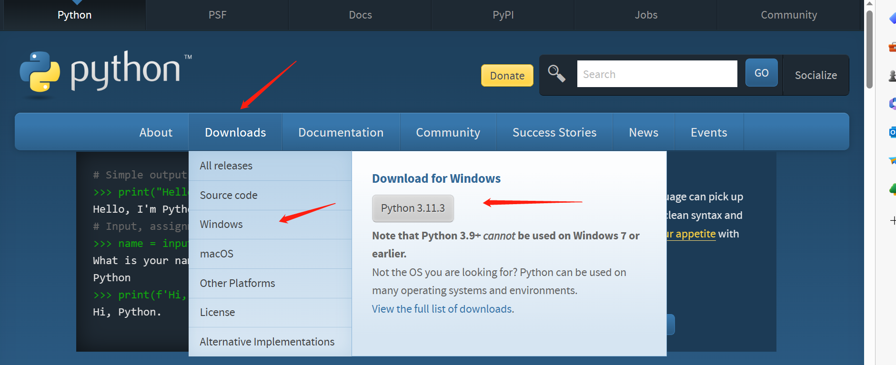

.. tip::

    Downloads菜单下面是各种平台及本版的python解释器，根据自己使用电脑操作系统选择相应的版本信息
    这个网站是python的官方网站，Documentation菜单下有使用文档，有机会可以自己下载看看

安装Python解释器
======================
下载成功后，双击安装程序，开始安装。

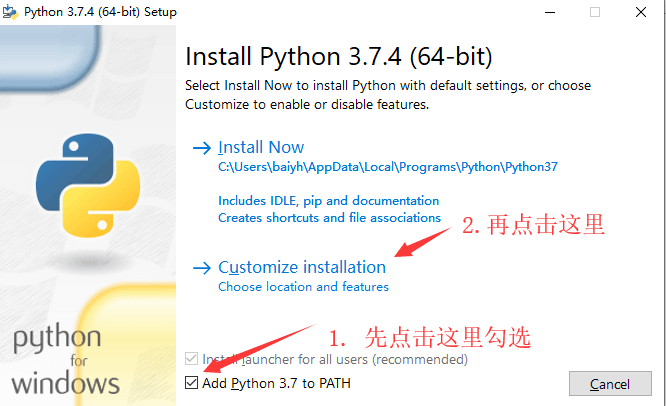

.. warning:: 
    安装到这一步的时候，一定要勾选 Add Python 3.8 to path 选项， 然后再点击 Customize installation

在下图这一步时，点击 Next 即可

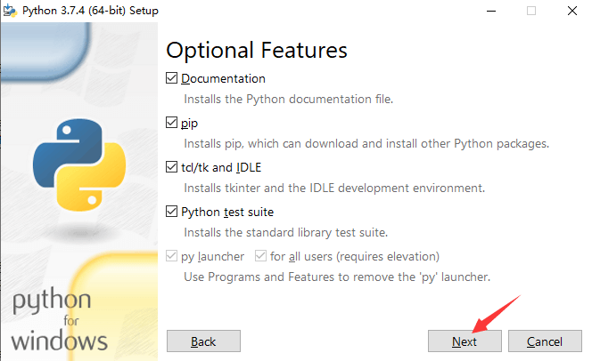

在下图这一步时，按图示步骤操作。随后，等待安装完成。

.. warning:: 
    安装目录不要使用缺省的 C:\Program Files\ ，这些是系统目录，可能会为以后的操作带来权限问题。

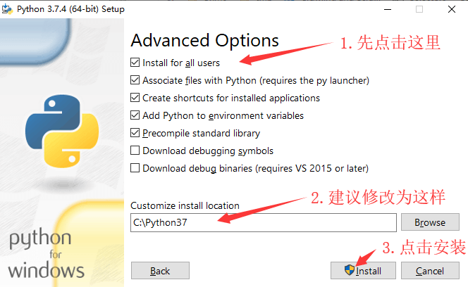

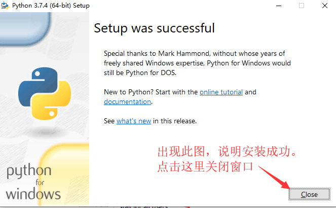

环境变量path
==============

前面 安装的时候，我们强调要勾选 Add Python3.8 to path ，这是什么意思呢？

就是把 **Python解释器所在的目录** 加入到 **环境变量Path** 中。

Windows 下，我们可以用 ``echo %path%`` 命令查看一下环境变量path的内容是什么。

比如，我的电脑执行结果如下

.. code-block:: console

    C:\Users\admin>echo %path%
    C:\Python38\;
    C:\Python27\;
    C:\Users\admin\AppData\Local\Programs\Python\Python310\Scripts\;
    C:\Program Files (x86)\Common Files\Oracle\Java\javapath;
    C:\Program Files (x86)\VMware\VMware Workstation\bin\;
    C:\Windows\system32;C:\Windows;C:\Windows\System32\Wbem;
    
环境变量 Path 中包含的 这些目录， 就是 **Windows查找程序的目录**

环境变量 Path 的内容包括了 **多个目录，目录之间用分号隔开**。

假如你编写了一段代码，保存到名为 code.py 的文件中， 当我们敲入下面的命令时，

``python code.py``

Windows 命令执行器 就会 依次 **搜索如下目录**：

.. code-block:: console

    C:\Users\admin>echo %path%
    C:\Python38\;
    C:\Python27\;
    C:\Users\admin\AppData\Local\Programs\Python\Python310\Scripts\;
    C:\Program Files (x86)\Common Files\Oracle\Java\javapath;
    C:\Program Files (x86)\VMware\VMware Workstation\bin\;
    C:\Windows\system32;C:\Windows;C:\Windows\System32\Wbem;

看这些目录中，是否有 **python.exe** 或者 **python.bat** 之类的可执行文件。

如果有就执行他们。

注意，在 ``C:\Python38\`` 和 ``C:\Python27\`` 这两个目录里面 都有python.exe，会执行哪个呢？

哪个目录在前面 ，就去执行哪个目录下面的python.exe。

比如现在是 ``C:\Python38\`` 在前面，就先执行  ``C:\Python38\`` 里面的 python.exe。

Python交互式命令行
======================

既然，现在 Python 所在目录已经在环境变量path中了。以后，我们要运行python程序，直接在命令行中敲 python就行了，
不必写上完整的Python.exe的路径。如下所示：

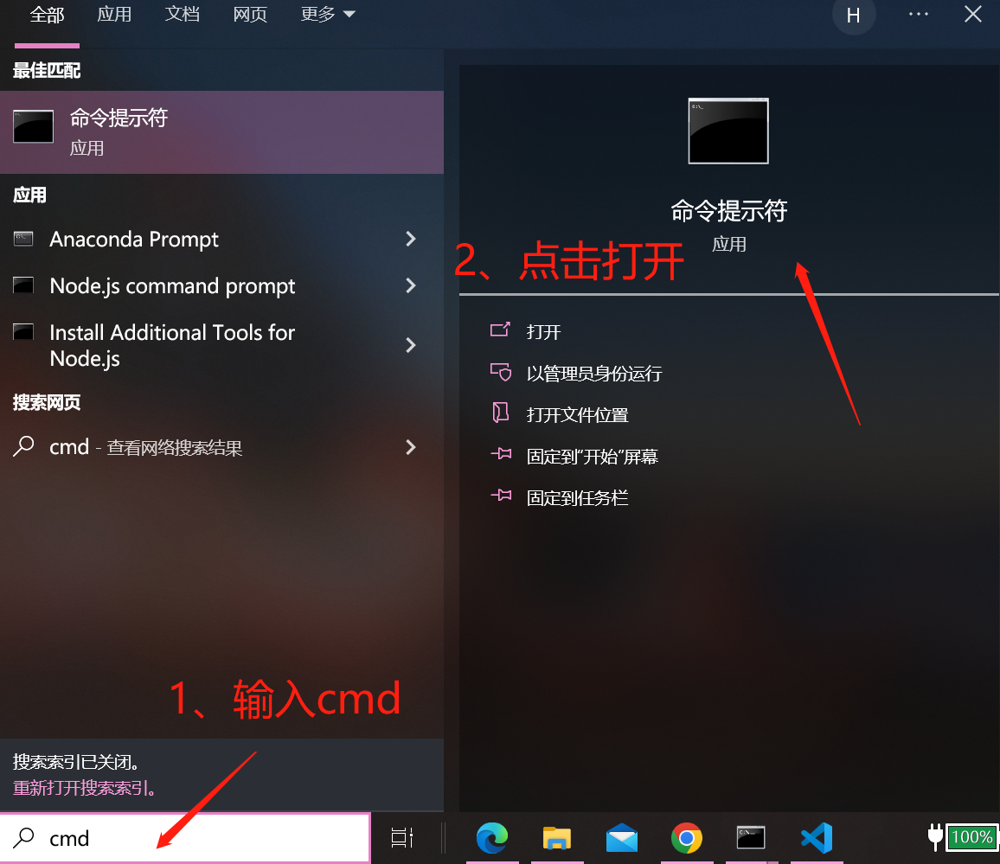

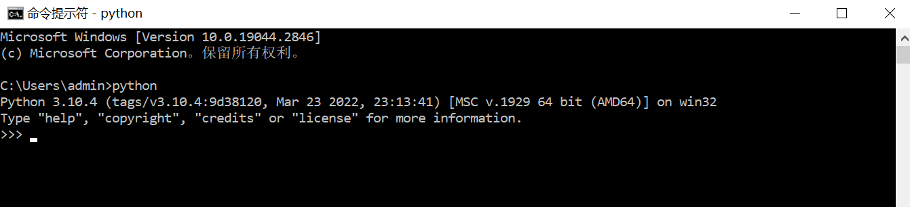

当我在命令行敲入 python 命令，后面不加任何参数的时候， 解释器就会运行一个 交互式的命令行 ，如上所示。

我们可以在 ``>>>`` 符号后面 直接输入python代码。

比如，我们可以在交互式命令行中输入一行代码 100 + 100

.. code-block:: console

    C:\Users\admin>python
    Python 3.10.4 (tags/v3.10.4:9d38120, Mar 23 2022, 23:13:41) [MSC v.1929 64 bit (AMD64)] on win32
    Type "help", "copyright", "credits" or "license" for more information.
    >>> 100 + 100
    200
    >>>

如果你要退出Python交互式命令行程序，回到Window命令行中，可以敲入语句 exit() ，如下所示

.. code-block:: console

    >>> exit()

    C:\Users\admin>

交互式命令行 主要用来 快速执行一些 简单的代码， 关闭窗口，敲的代码就没有了。

我们开发程序不可能 每次都手工把代码输入一遍 去运行。

所以，我们的代码需要 **写在代码文件中** 。

既然要在文件中写代码，就需要 **编辑代码** 文件的软件。
:download:`下载软件编辑器 <https://pan.baidu.com/s/10gGOOym-4oRoEXpwDKsk-g?pwd=6688>`。
``提取码：6688``

以后我们会教大家 **使用集成开发环境** 开发程序，那样编写代码就更方便了。

安装好notepad++后，做如下配置：

打开配置界面

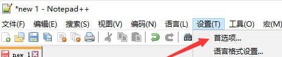

然后，设置所有tab按键用4个空格替换，如下所示

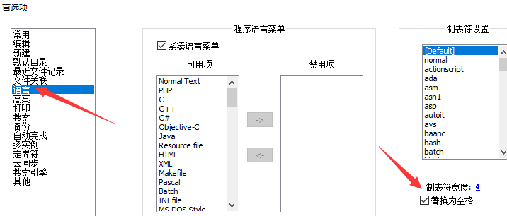
